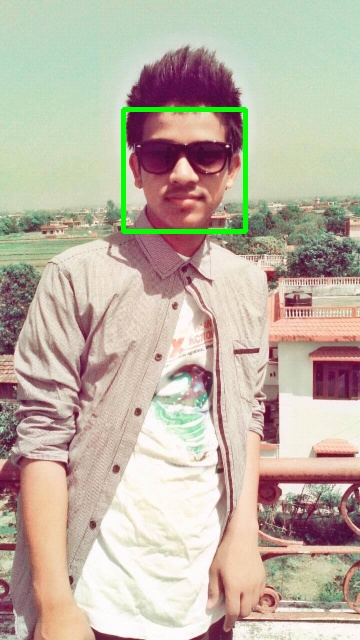

# Face-Detection-Using-OpenCV
 Face Detection is a computer technology being used in a variety of applications that identifies human faces in digital images. Face 
 Detection is the first step to Face Recognition.
 
 
 There are lots of algorithms and techniques to perform face detection. Some of the algorithms used in Face Detection are Fast-R-CNN,
 Faster-R-CNN,ReitnaFace etc. We can also create custom face detector by training our own CNN(Convolution Neural Networks) using deep
 learning.
 
 
 However, in this repository I have used  Viola Jones algorithm for face detection.The main property of this algorithm is that training is
 slow, but detection is fast.
 
 
 Viola-Jones was designed for frontal faces,so it is able to detect frontal the best rather than faces looking sideways, upwards or 
 downwards. Before detecting a face, the image is converted into grayscale, since it is easier to work with and there’s lesser data to
 process. The Viola-Jones algorithm first detects the face on the grayscale image and then finds the location on the colored image.
 
 
 Viola-Jones algorithm is available in OpenCV library so we have used opencv library to detect faces in images. The algorithm works on the basis of Haar-Cascade Classifier(i.e Harr Features). Here in this repository, we have detected frontal face using frontal face default xml file.
 
 # ORIGINAL IMAGE (IMAGE BEFORE DETECTING FACE)
  
  
## DETECTED IMAGE (IMAGE AFTER DETECTING FACE)
  
